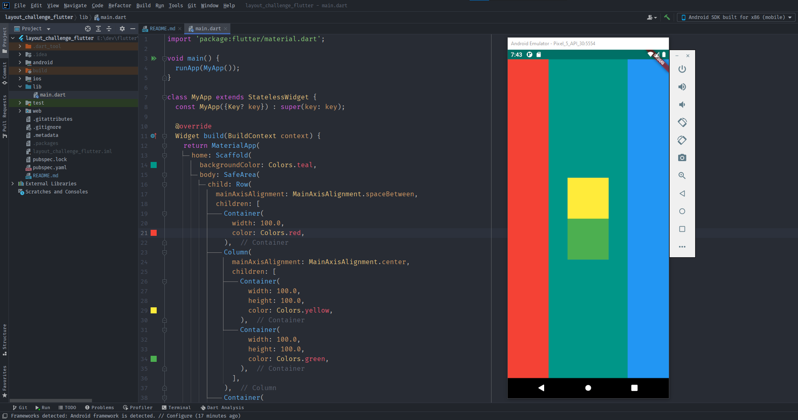

# layout_challenge_flutter

## Descrição
- Projeto simples para cumprir um desafio do
  curso: [The Complete 2021 Flutter Development Bootcamp with Dart](https://www.udemy.com/course/flutter-bootcamp-with-dart/)
- O desafio era simples, apenas criar Containers em Columns e Rows e alinhar como na imagem abaixo:
  

## Testar
  - Para testar o projeto basta clonar o repositório ```git clone https://github.com/felipepedrosa/layout_challenge_flutter.git``` navegar até a pasta e executar com o comando ```flutter run```
